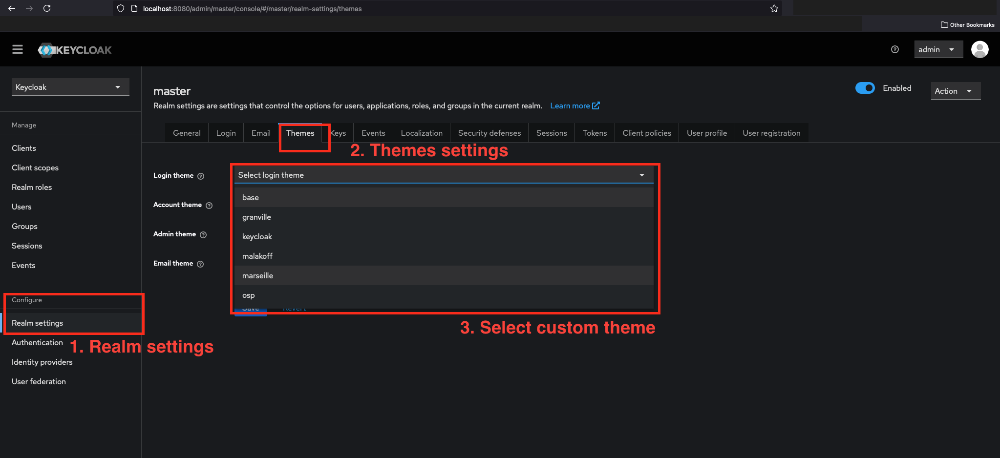

# Keycloak theme generator

Generate simple Keycloak customized theme using thor cli

## Requirements
* Ruby 2.7+
* Thor gem
* HTTParty gem
* ERB gem
* Docker (for running Keycloak)

## Getting started

1. Execute main.rb : `$ ruby main.rb theme --name <theme_name> --color <color> --logo <logo>`

Help is available with `$ ruby main.rb help theme`

2. Copy the generated theme to the Keycloak theme directory

A new directory should be present in `./data/` directory. Copy the content of this directory to the Keycloak theme directory.

## Run Keycloak and configure the theme

1. Start Keycloak server
    1. Build the docker image: `$ make build`
    2. Run the docker container: `$ make start`
2. Access the admin console
    1. Go to `http://localhost:8080`
    2. Login with the admin credentials (username: `admin`, password: `admin`)
3. Go to the realm settings
4. Go to the themes tab
5. Select the new theme in the dropdown
6. Save the changes
   

7. Go to the login page and see the new theme
     1. Open a new incognito window
     2. Go to `http://localhost:8080/realms/master/account`
     3. You should see the new theme

**Note: The theme is only applied to the login page. The account page is not styled.** 

**Note: You can modify theme directly and refresh page, changes will be applied thanks to Docker volume** 

## Generate JAR archive file

1. Execute main.rb : `$ ruby main.rb archive <version | 0.0.1>`
2. The JAR file will be generated in the `./dist/` directory

## Resources

* [Keycloak themes documentation](https://www.keycloak.org/docs/latest/server_development/#_themes)